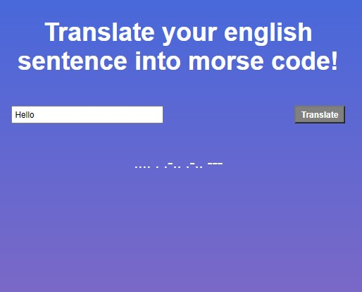

# morse-code-translator
This was a mini-project (completed as a tech test), in which we were tasked to created morse code translator. The translator needed to take in a string input (in English) and return its morse version.

This was a TDD project, so I had to use Jest to test whether the functions were outputting what I was expected them to do.

Click [here](https://kav97.github.io/morse-code-translator/) to view the project. 
